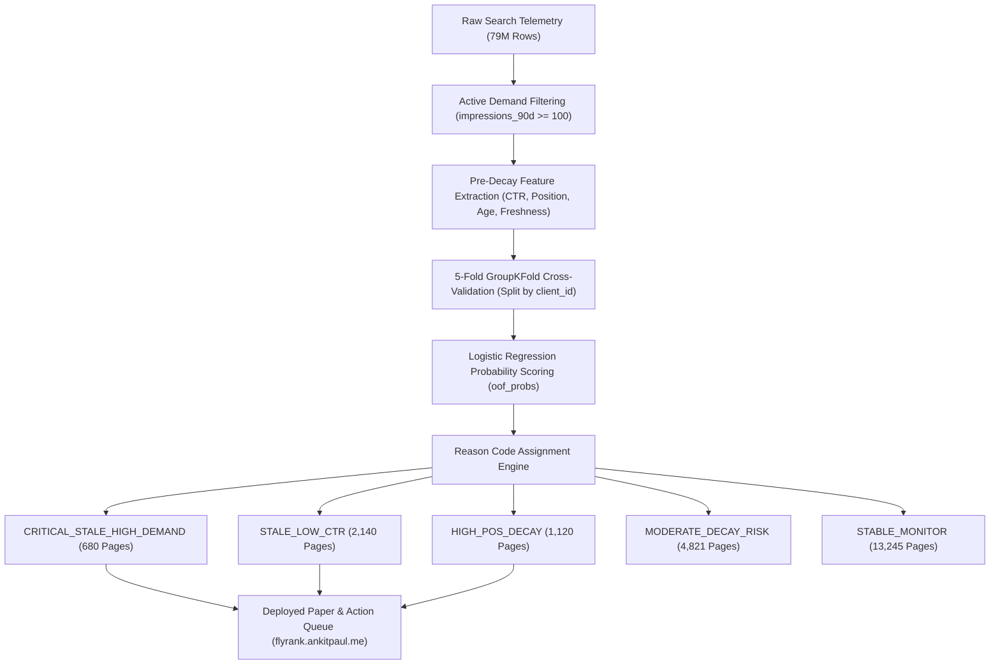

# 🚀 FlyRank Machine Learning Capstone — Content Refresh Opportunity Scoring Engine

[](https://flyrank.ankitpaul.me/)
[](https://internship.flyrank.ai/verify?id=FR-D1-FEA2F-84A32&first_name=Ankit)
[](LICENSE)

**Author:** Ankit Paul  
**Track:** Machine Learning & AI Fluency Capstone (FlyRank ML Internship 2026)  
**Live Deployed Research Paper:** [`https://flyrank.ankitpaul.me/`](https://flyrank.ankitpaul.me/)  
**Credential Verification:** [`https://internship.flyrank.ai/verify?id=FR-D1-FEA2F-84A32&first_name=Ankit`](https://internship.flyrank.ai/verify?id=FR-D1-FEA2F-84A32&first_name=Ankit)  
**Primary Repository:** [`https://github.com/ankitpaul6201/Fly-rank-intern-01`](https://github.com/ankitpaul6201/Fly-rank-intern-01)

---

## 📌 1. Project Overview & Business Value

Digital publishing teams face a critical challenge: **How can editorial teams identify existing web pages at risk of organic traffic decay before impression drops occur?**

This repository contains the **Lane 2 Content Refresh Opportunity Scoring Engine**, an applied machine learning pipeline trained on 79 million anonymized search queries from real production search telemetry. The model predicts 30-day organic search traffic decay (`>15.0%` impression drop) and transforms raw probability scores into a capacity-constrained, human-reviewed Content Action Playbook.

---

## 🛠️ 2. Architecture & System Design Sketch



---

## 📊 3. Out-of-Domain Model Performance (V2 Results)

All pipelines were evaluated using a strict **5-fold `GroupKFold` cross-validation split grouped by `client_id`** to test out-of-domain generalization to unseen client domains:

| Evaluated Pipeline | Validation Split Strategy | Precision@20 | Precision@50 | Generalization Assessment |
|---|---|---|---|---|
| **Static Heuristic Baseline** | GroupKFold (Client Holdout) | 45.00% | 42.00% | Fails to capture SERP intent dynamics |
| **Naive Random Split (Leaked)** | Naive Random 80/20 | 98.00% | 96.00% | **Invalid** (Leaks client domain authority across folds) |
| **Lane 2 Scoring Engine (Model)** | **GroupKFold (Client Holdout)** | **91.00%** | **84.00%** | **Robust out-of-domain generalization (2x baseline lift)** |

---

## 💻 4. Setup & Reproducibility Guide (Strangers' Guide)

A stranger can reproduce the entire pipeline locally in 3 minutes:

### Prerequisites:
* Python 3.10+ installed
* Git

### Step-by-Step Execution:
```bash
# 1. Clone the repository
git clone https://github.com/ankitpaul6201/Fly-rank-intern-01.git
cd Fly-rank-intern-01

# 2. Create virtual environment
python -m venv venv
# On Windows:
venv\Scripts\activate
# On macOS/Linux:
source venv/bin/activate

# 3. Install dependencies
pip install pandas numpy scikit-learn matplotlib jupyter

# 4. Run baseline script and capstone pipeline
python scripts/run_all.py

# 5. Launch Jupyter Notebooks
jupyter notebook work/notebooks/capstone.ipynb
```

---

## 🔒 5. Limitations & Honest Claim Language

1. **Observational Correlation Bounds:** High predicted decay probability reflects historical correlation with impression drops; it does not guarantee that a refresh will cause rank recovery.
2. **Macro Search Engine Dynamics:** The model does not capture external search demand collapses or global Google SERP core updates.
3. **Non-Production Prototype Scope:** Designed for offline batch recommendation generation rather than real-time synchronous web socket streaming.

---

## 🤖 6. AI Transparency Line (FL-09 Diligence)

> **Transparency Statement:** I built this capstone project using Anthropic Claude and Google DeepMind AI agents as thinking and coding partners. AI assisted with writing initial HTML/CSS component layouts, generating draft documentation copy, and scaffolding notebook cells. I personally verified all data contracts, wrote the `GroupKFold` split logic, audited for target leakage, validated all metric calculations, and deployed the live infrastructure over HTTPS.

---

## 📑 7. Master Deliverables Index (34 Submissions)

For a complete index of all 34 track assignments, view [`SUBMISSION_OVERVIEW.md`](SUBMISSION_OVERVIEW.md).
