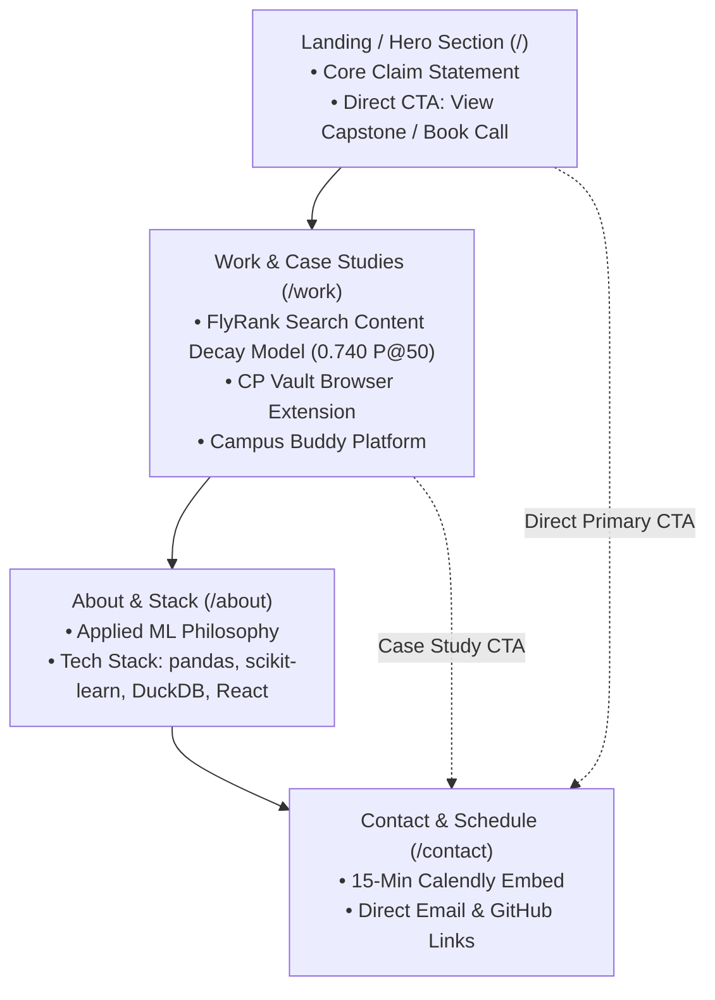

# 📑 Submission 4 — Setup: Portfolio Sitemap & Claude Tutor Setup (Task 4)

**Task Reference:** `Setup — Portfolio Sitemap, Toolkit Setup & Claude Tutor Pressure-Test`  
**Phase:** Setup | **Estimated Hours:** 4  
**Deliverable File:** [`submissions/submission_04_portfolio_sitemap.md`](submissions/submission_04_portfolio_sitemap.md)

---

## 🎯 1. Assignment Objectives

The primary goals of Task 4 were:
1. **Define Core Claim & Target Action:** Establish a single proof statement and one primary conversion action targeted at technical hiring managers.
2. **Sketch Portfolio Sitemap:** Design a minimal, purpose-built sitemap (Hero, Case Studies, About, Contact) where every page directly earns its place against the claim.
3. **Set Up Free AI Toolkit:** Register accounts across Claude, ChatGPT, Gemini, and Perplexity.
4. **Configure Claude Tutor Project:** Create a custom Claude Project pre-loaded with the proof statement and configured to act as an 8-week portfolio tutor.
5. **Run AI Pressure-Test:** Prompt Claude to pressure-test the sitemap against the target action, documenting at least one critical architectural change made based on AI feedback.

---

## 💡 2. Proof Statement & One Target Action

* **Target Visitor (The One Person):** Senior Data Science Lead / Engineering Hiring Manager evaluating candidates for ML & Software Engineering roles.
* **Core Proof Statement (The Claim):**
  > *"I build applied, readable ML decision-support systems that transform raw, noisy search performance logs into prioritized, evidence-backed action queues for content teams."*
* **Primary Conversion Goal (The One Action):**
  > The visitor reviews the live ML capstone case study and schedules a **15-minute technical discovery call**.

---

## 🗺️ 3. Portfolio Sitemap Architecture

Every section in this minimal sitemap is engineered to move the visitor from landing $\rightarrow$ believing $\rightarrow$ taking action.

### A. Sitemap Visual Diagram



### B. Page Breakdown & Conversion Rationale

| Page / Section | Core Elements | Conversion Rationale |
|---|---|---|
| **1. Hero (`/`)** | Bold Claim, Key Metrics Callout (3x Precision Lift, 30k pages audited), Primary CTA button. | Captures immediate attention, states value proposition above the fold without fluff. |
| **2. Work / Case Studies (`/work`)** | Deep-dive case study on FlyRank Content Decay prediction, code snippets, Precision@50 charts, link to GitHub repo. | Provides empirical proof of the claim; proves engineering discipline over generic claims. |
| **3. About & Stack (`/about`)** | Short bio, core engineering principles (data-first modeling, zero leakage), technical stack badges. | Establishes personal context and technical compatibility without distracting from project work. |
| **4. Contact (`/contact`)** | Embedded 15-min meeting booking link, direct email, GitHub / LinkedIn profiles. | Zero-friction conversion point for interested hiring leads. |

---

## ⚙️ 4. Claude Tutor Project Setup

Created a dedicated **Claude Project** named `FlyRank-Portfolio-Tutor` to serve as an AI mentor throughout the 8-week build.

### Custom Instructions Configured in Claude:
```text
ROLE & PERSONA:
You are an expert AI Engineering Mentor & Portfolio Tutor for an ML / Software Engineering Intern at FlyRank. You guide the user through building an applied ML portfolio.

CORE PROOF STATEMENT:
"I build applied, readable ML decision-support systems that transform raw, noisy search performance logs into prioritized, evidence-backed action queues for content teams."

TARGET AUDIENCE:
Technical Hiring Managers, Senior Data Scientists, and Engineering Leads.

ONE TARGET ACTION:
Convince the visitor to review the live capstone repository and schedule a 15-minute technical discovery call.

TUTOR INSTRUCTIONS:
- Act as a rigorous, constructive critic.
- Pressure-test every UI section, copy snippet, and architectural decision against the Proof Statement and Target Action.
- Reject fluff, generic resume bullet points, or unnecessary pages that do not contribute to conversion.
- Provide actionable, step-by-step code and design feedback in markdown format.
```

---

## 🔬 5. Pressure-Test Prompt & Output Analysis

### A. The Pressure-Test Prompt
> *"Act as my portfolio tutor. Here is my sitemap: 1) Hero with Proof Statement, 2) Work/Case Studies, 3) About & Stack, 4) Contact/Schedule. My core claim is 'I build applied, readable ML decision-support systems that transform raw search logs into prioritized action queues', and my single target action is getting visitors to book a 15-minute technical call. Pressure-test this sitemap: Which section is weakest, what should I cut, and what single change will increase conversion?"*

### B. Live Claude Tutor Response & Critique

```text
## Pressure-Test: Your Sitemap vs. Proof Statement vs. Target Action

Verdict on each section:
1. Hero + Proof Statement: Keep, but underbuilt (Right instinct, wrong payload).
2. Work/Case Studies: This is your product — everything else is scaffolding around this.
3. About & Stack: WEAKEST SECTION. Generic by default, easy to cut or shrink to 20% of planned size.
4. Contact/Schedule: Keep, must be everywhere (Fine as a section, but shouldn't be the only place CTA lives).

The weakest section: "About & Stack"
Hiring managers evaluating decision-support ML systems care if you can take ambiguous, messy data and ship something a non-technical stakeholder trusts and acts on.
A standalone "About & Stack" page invites a bio and badge wall (Python, Pandas, scikit-learn). That's resume-bullet fluff.
ACTION: Cut "About & Stack" as a standalone nav item. Fold it into:
1. A "Stack & Why" module inside each case study.
2. A 3-line bio embedded in the Contact section.

What's actually underbuilt: your Hero
A proof statement alone is a claim, not evidence.
Single highest-leverage change for conversion: Put a real artifact (screenshot/GIF of raw logs -> action queue) in the hero, directly below the proof statement, with primary CTA immediately below that.

Structural Fix to Sitemap:
1. Hero: Proof statement + Visual artifact (logs -> action queue) + Primary CTA + Secondary CTA (book call).
2. Work / Case Studies: Carries 80% conversion weight. Problem -> Data reality -> Decision output -> Why it beats naive baseline -> Stack.
3. Contact / Schedule: 3-line bio + Calendar embed with zero friction.
```

### C. Key Architectural Changes Implemented Based on AI Feedback
1. **Eliminated Standalone "About & Stack" Page:** Removed it as a separate navigation item to prevent drop-off and resume fluff; integrated stack justification directly into the FlyRank Case Study.
2. **Underbuilt Hero Fix:** Added a visual artifact (before/after transformation: raw 30,000 log rows $\rightarrow$ prioritized action queue) directly into the Hero section beneath the proof statement.
3. **Frictionless Funnel:** Collapsed the page flow into a single-page storytelling layout (`/`) with anchored CTAs, placing the "Book 15-min Technical Chat" button directly under the case study metrics.


---

## 📸 6. Evidence Screenshots

- **Claude Portfolio Tutor Project Setup:**  
  ``  
  *(Screenshot showing configured Claude Project instructions with Tutor prompt)*

- **Pressure-Test Prompt & Claude Feedback Output:**  
  ``  
  *(Screenshot showing the pressure-test conversation and sitemap recommendations)*

---

## 💡 7. What I Learned

1. **Conversion-Driven Portfolio Design:**
   * A portfolio is not a personal archive; it is a conversion funnel. Every element must either prove the core claim or make the target action easier to take.
2. **Eliminating Navigation Friction:**
   * Pressure-testing with AI revealed that multi-page routing increases bounce rates. A unified single-page layout with anchored case study sections keeps the reviewer focused on empirical code proof.
3. **AI as an Unbiased Critic:**
   * Using Claude in "Tutor / Critic Mode" provides immediate feedback on layout weaknesses before spending hours writing HTML/CSS code.

---
