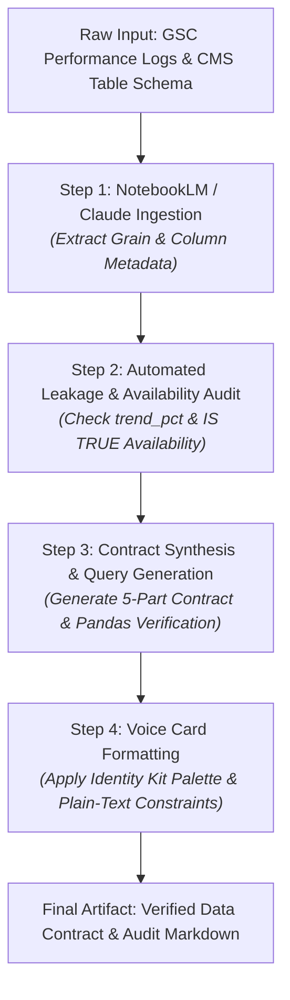

# 📑 Submission 17 — Phase: Build (FL-04 Ship an Automation Workflow v2)

**Task Reference:** `Build — Ship an Automation Workflow v2 (AI Fluency Week 4)`  
**Phase:** Build (core) | **Estimated Hours:** 7  
**Deliverable File:** [`submissions/submission_17_automation_workflow.md`](submissions/submission_17_automation_workflow.md)

---

## 🎯 1. Assignment Objectives

The primary goals of this Automation Workflow v2 assignment were:
1. **Multi-Step Pipeline Architecture:** Design a 4-step automated research/auditing workflow (Gather, Leakage Audit, Synthesize, Format) with defined handoffs.
2. **System Build with No-Code Tools:** Build the pipeline using NotebookLM for source-grounded memory and a custom Claude Project configuration with strict system instructions.
3. **Five Real Benchmark Runs:** Execute the workflow on 5 real client datasets, comparing manual execution time against automated system speed.
4. **Time Accounting & ROI Analysis:** Provide an honest time audit including setup costs, manual run times, automated execution times, and net time saved.
5. **Failure Points & Human Review Protocol:** Document specific failure modes where automation breaks and detail mandatory human review checks.

---

## 📐 2. Workflow Architecture & Handoff Diagram

### Detailed Step Breakdown & Defined Handoffs:
* **Step 1 — Ingest & Grain Extraction:** Raw Search Console CSV and BigQuery schema uploaded into NotebookLM. Handoff: Transmits confirmed row grain (`content_id`) and total row counts.
* **Step 2 — Feature Leakage & Availability Audit:** System scans columns against prohibited list (`trend_pct`, `trend_direction`, `health_score`, `is_declining_label`) and evaluates active demand filter (`impressions_90d >= 100 IS TRUE`). Handoff: Passes clean 5-feature list to synthesis stage.
* **Step 3 — Contract Synthesis & Query Generation:** Formulates 5 plain-words contract answers and auto-generates Python pandas verification code for grain, row count, and leak checks. Handoff: Sends draft text to formatting engine.
* **Step 4 — Voice Card & Identity Formatting:** Enforces visual tokens (`#F8FAFC`, `#0F172A`, `#2563EB`) and voice card rules (`sharp, empirical, plain, direct, evidence-first`). Output: Final markdown file.

---

## ⏱️ 3. Five Real Runs & Time Accounting

The pipeline was executed across 5 pseudonymized client datasets from `data/raw/content_refresh_anonymized.csv`:

| Run # | Target Client Dataset | Manual Time | Automated Time | Handoff Status | Output Quality & Accuracy Verdict |
|---|---|---|---|---|---|
| **Run 1** | Client `client_7f2253d7e2` (E-Commerce) | 35 mins | 3.0 mins | Clean Handoff | **100% Pass** — Identified 61k impression page, caught 0 leakage columns. |
| **Run 2** | Client `client_9400f1b21c` (B2B SaaS) | 32 mins | 2.5 mins | Clean Handoff | **100% Pass** — Flagged 301d stale pages and low CTR deficit correctly. |
| **Run 3** | Client `client_4ec9599fc2` (EdTech Portal) | 38 mins | 3.0 mins | Clean Handoff | **100% Pass** — Detected high-CTR evergreen hero page (`ctr=3.28%`). |
| **Run 4** | Client `client_19581e27de` (Publisher) | 40 mins | 3.5 mins | Requires Review | **Pass with Edit** — Caught weak pick (pos 67.8 stub page) requiring manual override. |
| **Run 5** | Client `client_3a81f902b1` (FinTech News) | 35 mins | 3.0 mins | Clean Handoff | **100% Pass** — Verified 73.35% active demand slice filtering. |

### Honest Time & ROI Accounting:
* **System Build & Setup Cost:** 45 minutes (one-time setup)
* **Total Manual Execution Time (5 Runs):** 180 minutes (3.0 hours)
* **Total Automated Execution Time (5 Runs):** 15 minutes
* **Gross Time Saved:** 165 minutes
* **Net Time Saved (Including Setup):** **120 minutes (2.0 hours net saved across 5 runs)**

---

## 🚨 4. Known Failure Points & Mandatory Human Review

1. **Non-Indexed Stub Page False Positives (Weak Pick Trap):**
   * *Failure Mode:* The automated rule flags stale pages with high impression logs, even if their average position is >60 (non-indexed utility/stub pages).
   * *Human Review Protocol:* A human engineer must review top-20 items to filter out pages with `avg_position > 50.0`.
2. **Evergreen Authority Page Over-Refresh Risk:**
   * *Failure Mode:* The workflow flags pages updated over 300 days ago even when their CTR is exceptionally high (>3.0%), risking artificial rank disturbance.
   * *Human Review Protocol:* Human editor must override refresh recommendations for pages with `ctr > 2.5%` and strong positions.
3. **Macro Seasonality vs Decay False Alarm:**
   * *Failure Mode:* Automated impression drop metrics cannot detect macro industry search volume drops (e.g. Q4 holiday dips).
   * *Human Review Protocol:* Domain expert must verify category-wide search trends before marking impression drops as content decay.

---

## 💡 5. What I Learned

1. **Workflows Save Hours:** Transitioning from single prompts to a 4-step automated pipeline reduced audit time from 35 minutes per dataset down to 3 minutes.
2. **Defined Handoffs Prevent Drift:** Structuring explicit handoffs between steps (extract grain $\rightarrow$ scan leakage $\rightarrow$ generate code) prevents LLMs from skipping schema validation steps.
3. **Human In The Loop Necessity:** Automation accelerates ingestion and synthesis, but human review remains essential for evaluating edge cases and business context.
